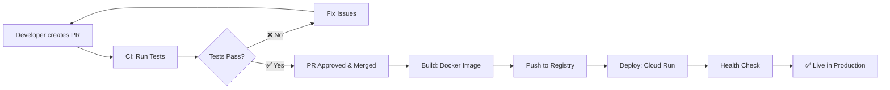

# CI/CD Pipeline Documentation

## 📋 Overview

The CI/CD pipeline has been split into 3 separate workflows for better control, faster feedback, and improved reliability:

1. **🧪 CI (Continuous Integration)** - Tests on PR
2. **🐳 Build** - Build & Push Docker image when merged
3. **🚀 Deploy** - Deploy to Cloud Run when image is ready

## 🔄 Workflow Sequence



## 📁 Workflow Files

### 1. 🧪 CI Workflow (`.github/workflows/ci.yml`)

**Trigger:** Pull Request to `main` branch

**What it does:**

- Runs on every PR (opened, updated, reopened)
- Builds Docker image for testing
- Runs pytest in isolated Docker containers
- Performs code quality checks (Black, isort, flake8)
- Provides fast feedback to developers

**Jobs:**

- `test`: Runs unit tests using pytest
- `code-quality`: Checks code formatting and linting

### 2. 🐳 Build Workflow (`.github/workflows/build.yml`)

**Trigger:** Push to `main` branch (when PR is merged)

**What it does:**

- Builds production Docker image
- Tags with timestamp and commit SHA
- Pushes to Google Artifact Registry
- Triggers deployment workflow
- Saves build artifacts for deployment

**Features:**

- Unique image tags for each build
- Both tagged and `:latest` versions
- Secure GCP authentication
- Artifact sharing between workflows

### 3. 🚀 Deploy Workflow (`.github/workflows/deploy.yml`)

**Trigger:** Automatically after successful build OR manual trigger

**What it does:**

- Deploys Docker image to Google Cloud Run
- Configures production environment variables
- Performs health checks
- Provides deployment summary

**Features:**

- Manual deployment option with custom image tags
- Health check verification
- Deployment status reporting
- Production environment protection

## 🚦 Usage Guide

### For Developers

1. **Create a Pull Request:**

   ```bash
   git checkout -b feature/my-feature
   git push origin feature/my-feature
   # Create PR via GitHub UI
   ```

2. **CI Runs Automatically:**

   - Tests must pass before merging
   - Code quality checks must pass
   - Review any failures and fix issues

3. **Merge When Ready:**
   - CI ✅ + Code Review ✅ = Ready to merge
   - Build and deploy happen automatically

### For DevOps/Maintainers

#### Manual Deployment

You can manually deploy any image tag:

1. Go to **Actions** → **Deploy - Cloud Run**
2. Click **Run workflow**
3. Enter the image tag you want to deploy
4. Optionally force deploy (skips image verification)

#### Rollback

To rollback to a previous version:

1. Find the previous image tag in build history
2. Use manual deployment with that tag
3. Or redeploy from a previous commit

## 🔧 Configuration

### Required Secrets

Make sure these GitHub secrets are configured:

```
VERTIONE_APPLICATION_CREDENTIALS  # GCP Service Account Key
VERTIONE_PROJECT_ID              # GCP Project ID
DATABASE_URL                     # Production Database URL
CLOUD_PROJECT_ID                 # Cloud Project ID
FIREBASE_CREDENTIALS             # Firebase Service Account (Base64)
```

### Environment Protection

The deploy workflow uses the `production` environment (commented out by default). To enable:

1. Go to **Settings** → **Environments** → **New environment**
2. Create `production` environment
3. Add protection rules (required reviewers, etc.)
4. Uncomment the `environment: production` line in `deploy.yml`

## 📊 Monitoring & Debugging

### Check Workflow Status

- **CI Status:** Visible on PR page
- **Build Status:** Check Actions tab after merge
- **Deploy Status:** Monitor deployment progress

### Common Issues

#### Tests Failing

```bash
# Run tests locally
docker-compose up -d postgres_db
docker-compose exec fastapi_app pytest tests/ -v
```

#### Build Failing

- Check Docker build logs
- Verify GCP credentials
- Check artifact registry permissions

#### Deploy Failing

- Verify image exists in registry
- Check Cloud Run service configuration
- Review environment variables

### Logs and Monitoring

```bash
# View Cloud Run logs
gcloud logs read --service=vertione --project=YOUR_PROJECT_ID

# Check service status
gcloud run services describe vertione --region=us-central1
```

## 📈 Performance Benefits

### Old Monolithic Pipeline

- ❌ Long feedback loops (build + deploy on every PR)
- ❌ Resource waste (building production images for tests)
- ❌ All-or-nothing deployments

### New Split Pipeline

- ✅ Fast PR feedback (tests only)
- ✅ Efficient resource usage
- ✅ Independent build and deploy stages
- ✅ Better error isolation
- ✅ Manual deployment control

## 🔄 Pipeline Metrics

- **CI Runtime:** ~3-5 minutes
- **Build Runtime:** ~5-8 minutes
- **Deploy Runtime:** ~2-3 minutes
- **Total Time (PR → Production):** ~10-15 minutes

## 🛠️ Customization

### Adding New Test Steps

Edit `.github/workflows/ci.yml`:

```yaml
- name: 🔧 Your Custom Test
  run: |
    # Your test commands here
```

### Modifying Build Process

Edit `.github/workflows/build.yml`:

```yaml
- name: 🔧 Custom Build Step
  run: |
    # Your build commands here
```

### Environment Variables

Add to deploy workflow environment variables:

```yaml
--set-env-vars="YOUR_VAR=${{ secrets.YOUR_SECRET }}"
```

## 🆘 Support

For issues with the pipeline:

1. Check the Actions tab for error details
2. Review this documentation
3. Check GCP console for infrastructure issues
4. Contact the DevOps team

---

📝 **Last Updated:** $(date)
🔗 **Repository:** [Your Repo Link]
